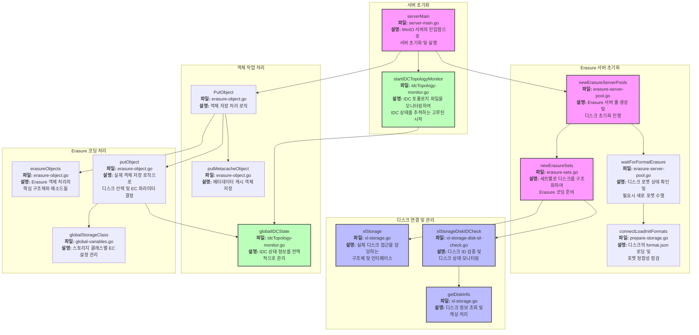

# MinIO 시스템 구조 다이어그램

아래는 MinIO의 주요 컴포넌트와 그 관계를 시각화한 다이어그램입니다.

## 주요 컴포넌트 설명

### 1. 서버 초기화
- **serverMain**: MinIO 서버의 진입점 함수로 모든 초기화 과정을 관리
- **startIDCTopologyMonitor**: IDC 토폴로지 파일(`/tmp/minio/topology/idc-topology.json`)을 주기적으로 모니터링하는 고루틴 실행

### 2. Erasure 서버 초기화
- **newErasureServerPools**: 여러 서버 풀을 생성하고 디스크 정보 처리
- **waitForFormatErasure**: 디스크 포맷 상태 확인 및 필요시 초기화
- **connectLoadInitFormats**: 디스크의 `format.json` 메타데이터 검증
- **newErasureSets**: Erasure 코딩을 위한 디스크 세트 구성

### 3. 디스크 연결 및 관리
- **xlStorage**: 실제 디스크에 접근하는 로우 레벨 구현체
- **xlStorageDiskIDCheck**: 디스크 ID 검증 및 상태 모니터링
- **getDiskInfo**: 디스크 정보 조회 및 캐싱

### 4. 객체 작업 처리
- **PutObject**: 클라이언트의 객체 저장 요청 처리
- **putMetacacheObject**: 시스템 메타데이터 캐시 저장
- **globalIDCState**: IDC 상태 정보를 전역으로 관리

### 5. Erasure 코딩 처리
- **erasureObjects**: Erasure 객체 처리의 핵심 구현체
- **putObject**: EC 파라미터 결정 및 디스크 선택 알고리즘 구현
- **globalStorageClass**: 스토리지 클래스별 EC 설정 관리

## 주요 흐름 설명

1. `serverMain`에서 서버 시작 시 `newErasureServerPools`를 통해 디스크 초기화
2. 동시에 `startIDCTopologyMonitor`를 실행하여 IDC 상태 모니터링 시작
3. `PutObject` 요청 시 현재 IDC 상태에 따라 EC 파라미터 조정
4. 활성 IDC 수에 따라 다른 EC 설정 적용:
   - 3개 IDC 활성: EC12 (데이터 7, 패리티 5)
   - 2개 IDC 활성: EC8 (데이터 4, 패리티 4)
